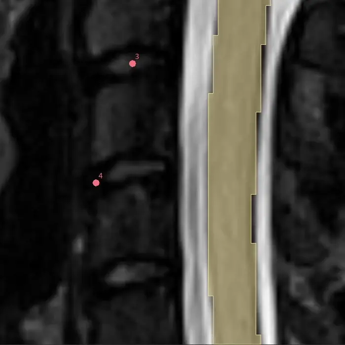

# Markup
This task allows for the placement, correction, and/or removal of labeled markup positions.

## Cohort File Specifications

This task follows the [CART Standard Cohort Specification](../../utils/README.md#the-cart-standard-format)
