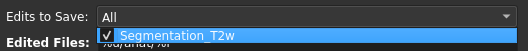
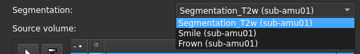
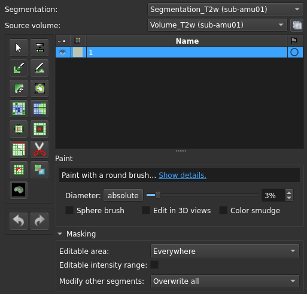
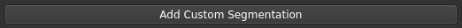
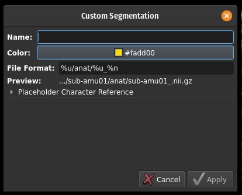
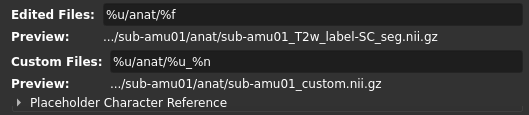

# Segmentation Task

This task allows for the creation, review, and correction of segmentations on a case-by-case basis. To aid in this, you can load multiple volumes, segmentations (either to reference or review/correct), and markup labels on a case-by-case basis.

## Using This Task

### Specifying Segmentations to Save

Given your cohort had at least one "segmentation" feature within it, you can those you wish to save after review/editting from the following drop-down:

Edits made to any segmentation selected in this list will be saved when CART saves the active case. All other loaded segmentations will be treated as "reference" segmentations; while they can still be edited, those changes will be **IGNORED** when CART saves the case, and discarded when the segmentation is dropped from CART's cache!

### Editing a Segmentation

To edit a given segmentation, first select it from the following dropdown:

Once selected, you can edit the corresponding segmentation using the suite of tools provided by Slicer. Hover the mouse over each to get a tooltip, and select them to get even more details and configurations options:

### Adding a "Custom" Segmentation

To add a "custom" segmentation (that is, a segmentation you want to make from-scratch for each case), simply click on the "Add Custom Segmentation" button at the bottom of the GUI:

This should bring up the following dialogue:

Filling out each element and clicking "Apply" will create a new segmentation with the corresponding features; this will also occur for any subsequent cases you may run. This segmentation can be selected and edited like any other segmentation, with any changes made to it being saved as expected.

### Defining Output Destinations

Just underneath the "Edits to Save" dropdown, you will see two editable text fields:

"Edited Files" will dictate where any segmentations you which were loaded from file (and, presumably, reviewed/corrected by you) will be saved when you save the case. For "from-scratch" segmentations, the "Custom Files" value will be the _default_ destination for any segmentations which were not edited. These "from scratch" segmentations can be either custom segmentations you explicitly added, or segmentations which were missing in the case and had to be created by you. 

NOTE: blank segmentations (those with no segments within them) are never saved by CART. This is to avoid creating "empty" files.

## Cohort File Specification

This task follows the [CART Standard Cohort Specification](https://github.com/SomeoneInParticular/CART/tree/main/CART/CARTLib/utils#the-cart-standard-format)