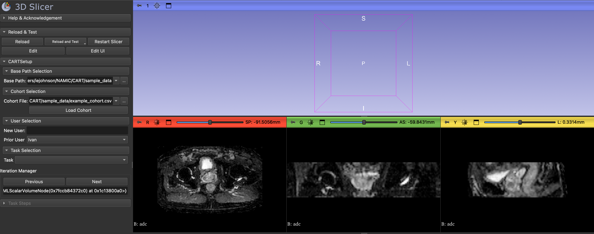
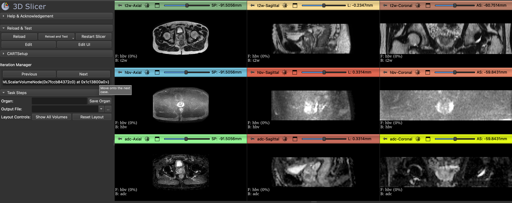

# CART Base Classes: Generic Iterator Framework for 3D Slicer

## Overview

CART (Case Annotation and Review Tool) provides a set of abstract base classes for creating streamlined annotation workflows in 3D Slicer. The framework enables efficient iteration through medical imaging cohorts with customizable tasks and flexible data loading strategies.

## Contributors

- **Ivan Johnson-Eversoll** (University of Iowa, USA)
- **Kalum Ost** (Montreal Polytechnic, Canada) 
- **Kuan Yi** (Montreal Polytechnic, Canada)

*With inspiration from SlicerCART, mpReview, and CaseIterator*

## Design Philosophy

### Minimal Requirements, Maximum Flexibility

The framework enforces only **one requirement**: 
- A CSV file with a `uid` column for unique case identification

We chose CSV for its **simplicity and universal usage** - it's human-readable, version-controllable, and supported by every data processing tool.

### Pluggable Data Loading Architecture

The key innovation is the **DataUnit abstraction layer** that decouples data sources from task logic:

```
CSV (uid + metadata) → DataUnit → Task Logic
     ↓                    ↓           ↓
  Universal            Pluggable   Reusable
  Interface            Loaders     Tasks
```

This design enables multiple data loading strategies:

#### Local File Support
```python
class VolumeOnlyDataUnit(DataUnitBase):
    # Loads .nrrd files from local filesystem
    # Supports relative paths with configurable base directory
```

#### DICOM Integration (Future)
```python
class DICOMDataUnit(DataUnitBase):
    # Query DICOM database by SeriesInstanceUID
    # Automatic series type detection and loading
    # Built-in de-identification handling
```

#### Cloud/Remote Loading (Future)
```python
class CloudDataUnit(DataUnitBase):
    # Download from S3, Google Cloud, or IDC
    # Automatic caching and prefetching
    # Authentication handling
```

## Key Design Benefits

### 1. **Task-Agnostic Data Loading**
Tasks don't need to know whether data comes from local files, DICOM databases, or cloud storage. They simply request resources through the standard `get_resource(key)` interface.

### 2. **Data Source Migration**
Switch from local NIfTI files to a DICOM database by changing only the DataUnit type - no task code changes required.

### 3. **Parallel Development**
Data engineers can optimize loading strategies while UI developers focus on annotation workflows, all working against the same abstract interface.

### 4. **Custom Hanging Protocols**
Tasks can define sophisticated view layouts and multi-volume displays without coupling to specific data formats.

## Architecture Overview

### Core Components

#### DataUnitBase (Abstract)
- **Purpose**: Abstract interface between CSV metadata and loaded Slicer data
- **Responsibility**: Validate data, load resources, manage MRML scene integration
- **Extensibility**: Subclass for different data sources (files, DICOM, cloud, etc.)

#### DataManager  
- **Purpose**: CSV cohort management and efficient case navigation
- **Features**: Sliding window traversal, wraparound navigation, progress tracking
- **Future**: Multi-scene prefetching for seamless user experience

#### TaskBaseClass (Abstract)
- **Purpose**: Generic framework for annotation/review tasks
- **Features**: GUI integration, automatic data binding, save/resume capability
- **Customization**: Define custom hanging protocols and user interfaces

## Prefetching and Multi-Scene Support

The framework is designed to support **prefetching multiple scenes** for improved performance:

### Current Implementation
- Single scene with lazy loading
- Automatic scene clearing on navigation

### Future Enhancement
- Background loading of next/previous cases
- Intelligent memory management
- Seamless transitions without loading delays

## Custom Hanging Protocols

Tasks can implement sophisticated display logic:

```python
class MultiContrastTask(TaskBaseClass):
    def setup(self, data_unit):
        # Custom layout: T1w background, T2w foreground, FLAIR in separate view
        volumes = [data_unit.get_resource(key) for key in ['T1w', 'T2w', 'FLAIR']]
        self.layoutLogic.viewerPerVolume(volumes, background=volumes[0])
```

## CSV Format Specification

The only requirement is a `uid` column.
All other columns are interpreted as resource identifiers.
We support saving to the Input CSV or a separate output CSV.:

```csv
uid,T1w,T2w,segmentation,notes
patient_001,/data/001/t1.nrrd,/data/001/t2.nrrd,,needs_review
patient_002,/data/002/t1.nrrd,/data/002/t2.nrrd,/segs/002.nrrd,complete
```


## Getting Started

### 1. Create Your DataUnit
```python
class MyDataUnit(DataUnitBase):
    def _validate(self):
        # Ensure your data meets requirements
        
    def _initialize_resources(self):
        # Load data into Slicer scene
        
    def to_dict(self):
        # Export for saving back to CSV
```

### 2. Create Your Task
```python
class MyTask(TaskBaseClass):
    def buildGUI(self, container):
        # Build your annotation interface
        
    def setup(self, data_unit):
        # Configure views and load data
        
    def save(self):
        # Save annotations/results
```

### 3. Prepare Your CSV
- Include `uid` column with unique identifiers
- Add columns for each resource (images, segmentations, etc.)
- Use paths appropriate for your chosen DataUnit implementation

# Step 1
Get Started by simply selecting your CSV file in the module interface.
And Select your "User" or add a new one.
You can Then navigate through your data using the "Next" and "Previous" buttons.


# Step 2

Select your task from the dropdown menu.


# Step 3 
 And complete the "Action" you want to perform. And you can still use the same 
"Next" and "Previous" buttons to navigate through your data.
